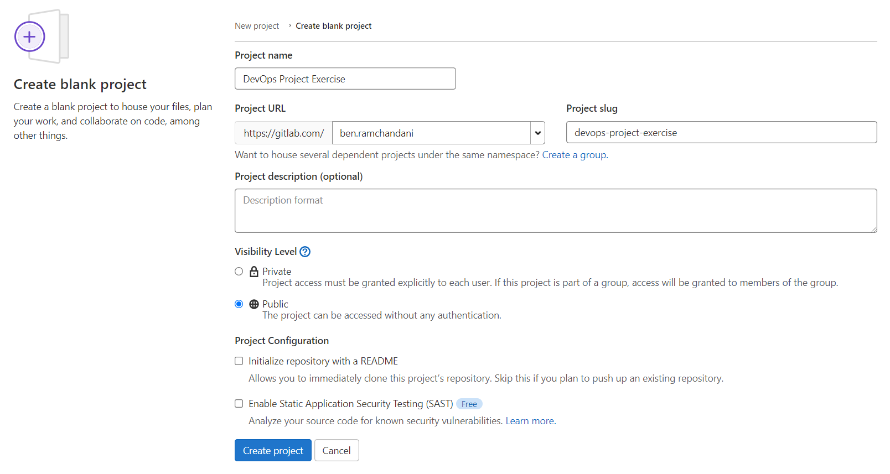

# GitLab

Cohorts can use GitLab as an alternative repository host instead of GitHub.
GitLab is open source and can be self hosted, but we use the main instance at <https://gitlab.com/>.

## Alternative setup for Module 1

You can use GitLab instead of GitHub for your project exercise.
It is largely a drop in replacement, but where the project exercise instructions are GitHub specific we provide alternative instructions here.

### Setup: Checkout the starter project

[Sign up for a GitLab account here](https://gitlab.com/users/sign_up).

Follow the Module 1 Project exercise instructions up to and including cloning the starter project.

```sh
git clone https://github.com/CorndelWithSoftwire/DevOps-Course-Starter.git
cd DevOps-Course-Starter
```

Now, create a new repository on GitLab.com:

* Go to the [Create a blank project](https://gitlab.com/projects/new#blank_project) page on GitLab
* Enter a name for your project, e.g. "DevOps Project Exercise"
* Set the visibility to "Public", and untick the other options, then click "Create project"



Now run the following commands to push your existing repository to GitLab:

```sh
git remote remove origin # Unlink the original GitHub repository
git remote add origin https://gitlab.com/your-username/devops-project-exercise.git # Replace "your-username" as appropriate, and make sure the repository name is correct.
git push --set-upstream origin master # Push the current branch
```

There's no need to add us as members of your project unless you made it private.
You can now carry on with the rest of the exercise from "Step 2: Installing and Running the Flask Web Application" until you're ready to submit your work.

### Submitting your work

We'll be using GitLab's Merge Request feature (instead of GitHub's Pull Requests) to submit work for marking. The process is very similar:

1. Make sure all your changes have been made on a new branch with the module number (e.g. `exercise-1`)
2. Push that branch to your remote repository on GitLab, e.g. `git push origin exercise-1`
3. Visit your repository on GitLab, click "Merge requests" on the left hand side and then "New merge request".
The source branch should be the one you just pushed and the target your master or main branch.
4. Fill in the title and then create the merge request.
5. Submit the URL for the merge request as your exercise solution on Aptem.

You can submit further changes to the merge request once it's created by committing those changes to your local branch (`exercise-1`) and then pushing them to the remote branch on GitLab. The merge request will update automatically.
